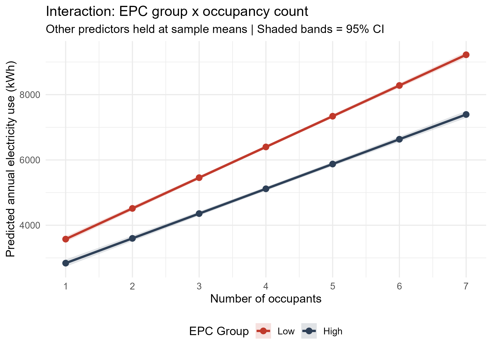
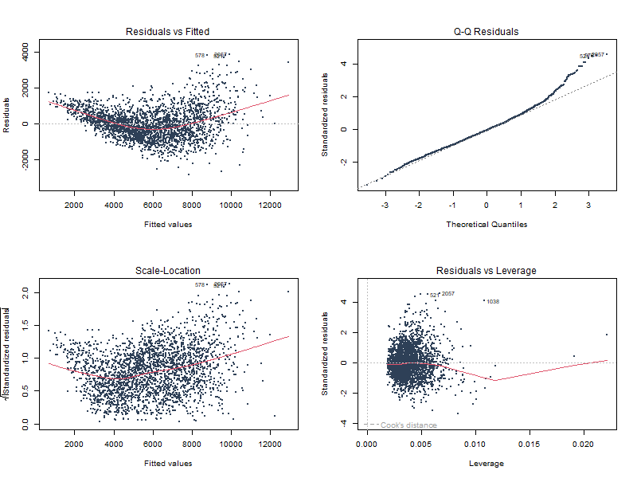

# Determinants of Household Electricity Consumption

**Statistical analysis of residential electricity consumption among Belgian households using multiple linear regression in R.**

**Author:** Yiwu Ongum Ihimbru
**Institution:** Hasselt University
**Course:** Project Learning from Data

## Project Overview

This project investigates the factors associated with annual household electricity consumption using data from Belgian households.

The analysis addressed four main research questions:

* Which household and building characteristics best explain annual residential electricity consumption?
* How does electricity consumption differ across Energy Performance Certificate (EPC) ratings?
* Does household income independently affect electricity consumption after accounting for structural and occupancy characteristics?
* Does the relationship between household occupancy and electricity consumption depend on EPC performance?

## Project Files

* [View the full R analysis](analysis/electricity_analysis.Rmd)
* [View the full statistical report](report/household_electricity_consumption.pdf)

## Key Visualisation

The figure below shows how the relationship between household occupancy and predicted electricity consumption differs between high- and low-EPC homes.



The interaction indicates that electricity consumption increases with household occupancy in both EPC groups, but the increase is steeper among low-EPC homes.

## Methods

The statistical workflow included:

* Data cleaning and validation
* Exploratory data analysis
* Multiple linear regression
* Bidirectional stepwise AIC model selection
* Model diagnostics
* Standardised coefficient comparison
* EPC group comparisons
* Interaction modelling
* Nested model F-tests

After data validation and complete-case analysis, the final analytical dataset contained **2,477 households**.

## Key Findings

* Household occupancy was the strongest predictor of electricity consumption.
* Each additional resident was associated with approximately **874 kWh higher annual electricity consumption**.
* Each additional square metre of living area was associated with approximately **23 kWh higher annual electricity consumption**.
* Electricity consumption increased progressively from EPC label A to EPC label F.
* EPC F households consumed approximately **2,383 kWh more per year** than EPC A households after adjustment for other predictors.
* Household income was not statistically significant after accounting for structural and occupancy characteristics.
* A significant interaction was observed between EPC performance and household occupancy.
* The electricity-saving advantage associated with high-EPC homes increased as household size increased.

## Statistical Model

The preferred multiple linear regression model included:

* Living area
* EPC label
* Household occupancy
* Household income
* Distance to Brussels

The preferred model achieved an **adjusted R² of 0.853**.

## Model Diagnostics

Model assumptions were assessed using:

* Residuals versus fitted values
* Q-Q plots
* Scale-location plots
* Generalised Variance Inflation Factors (GVIF)
* Leverage diagnostics

The diagnostic assessment showed some mild curvature and variation in residual spread, together with some upper-tail deviation from normality. However, no severe departure from the assumptions required for the analysis was observed.

The diagnostic plots are available here:



## Tools and Techniques

* **R** — statistical analysis, modelling and visualisation
* **R Markdown** — reproducible analysis workflow
* **LaTeX** — statistical report preparation
* Multiple linear regression
* Stepwise AIC model selection
* Regression diagnostics
* Standardised coefficients
* Interaction analysis
* Nested model comparison

## Repository Structure

```text
household-electricity-consumption-analysis/
├── README.md
├── analysis/
│   └── electricity_analysis.Rmd
├── data/
│   └── README.md
├── figures/
│   ├── diagnostics_preferred.png
│   └── interaction_plot.png
└── report/
    └── household_electricity_consumption.pdf
```

## Academic Context

This project was developed in the context of the **Project Learning from Data** course at Hasselt University.

The statistical workflow presented in this repository, including data cleaning, model implementation, diagnostics, statistical interpretation, visualisation and report preparation, was carried out by me.

This repository has been organised as a portfolio version of the project to demonstrate the complete statistical analysis workflow and ensure that the analysis is clearly documented and reproducible.

## Data Availability

The original dataset is not included in this public repository because it was provided for academic purposes.

A description of the expected data structure and variables used in the analysis is provided in the [`data/README.md`](data/README.md) file.

The repository therefore focuses on the statistical methodology, analysis workflow, results, visualisations and final report.

## Disclaimer

This project was completed for educational purposes. Because the data are cross-sectional, the reported relationships should be interpreted as associations rather than causal effects.
